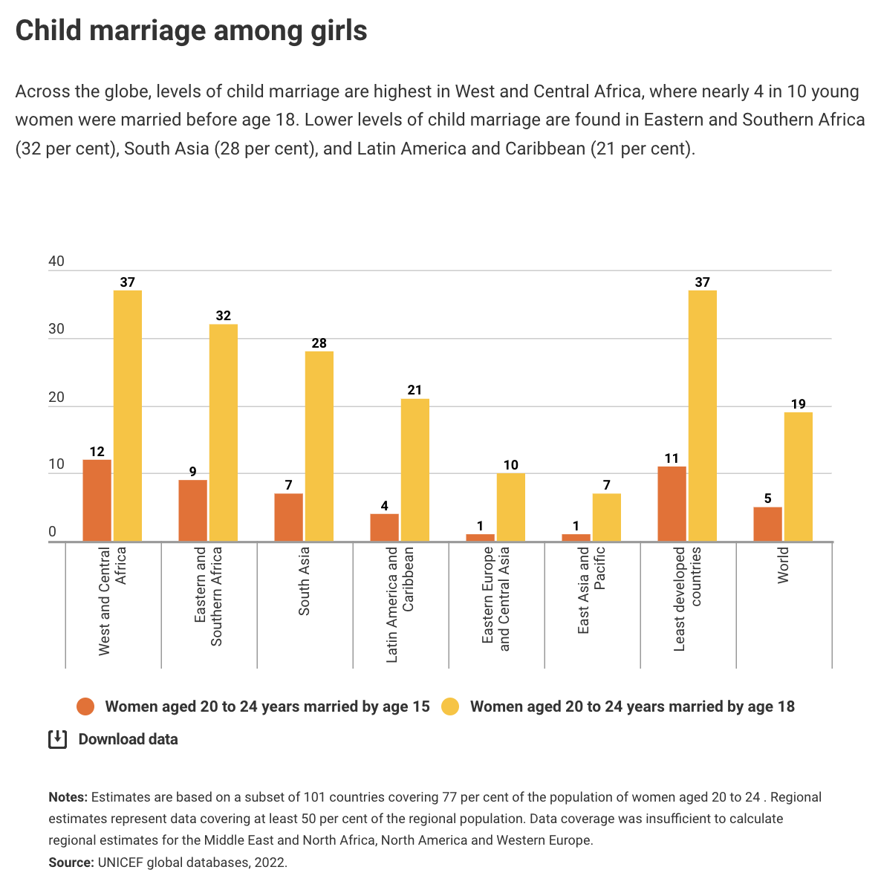
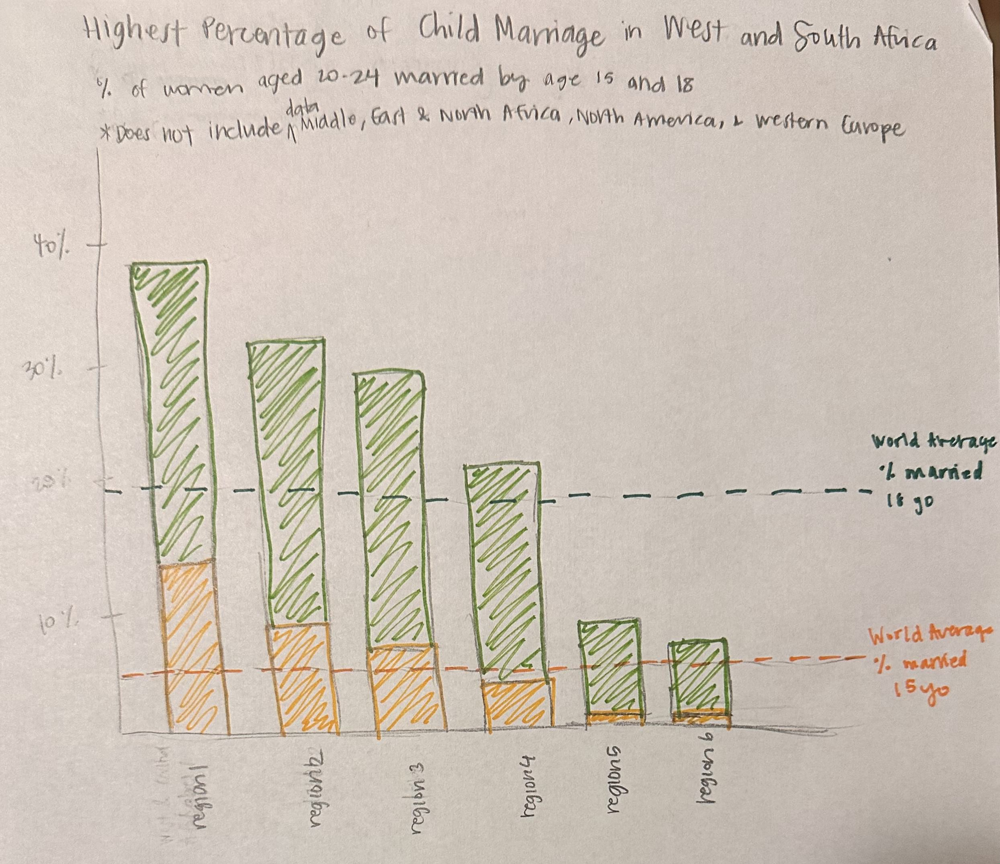
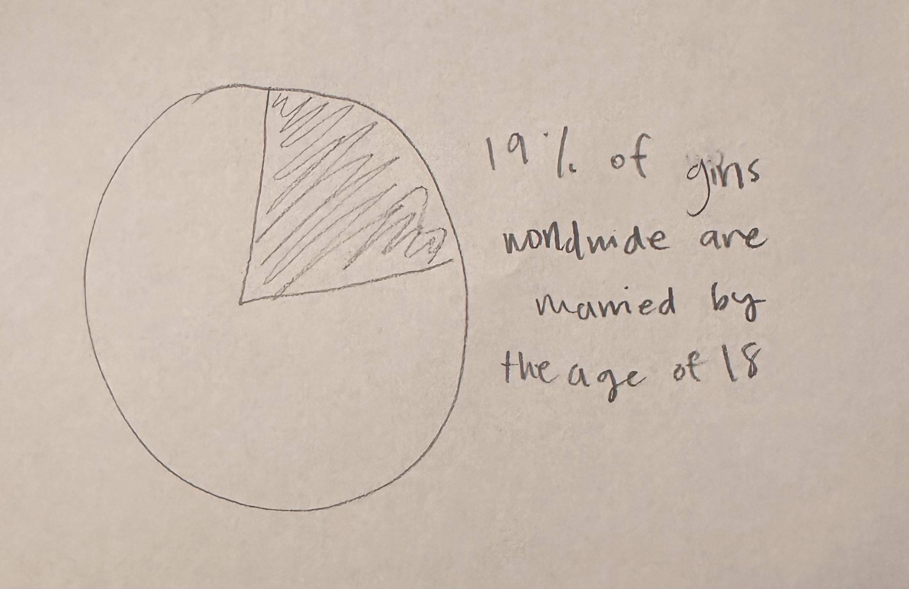

[home page](/README.md) || [visualizing government debt](/visualizing-government-debt.md) || [final project: part 1](/final-project-part-one.md) || [final project: part 2](/final-project-part-two.md) || [final project part 3](final-project-part-three)

# Assignment 3 & 4: Critique by Design with Tableau (MakeoverMonday)

## Step 1: Choose a data visualization from MakeoverMonday
The task for this assignment was to critique and redesign an existing visualization. I started off by exploring the [Makeover Monday](https://makeovermonday.co.uk/) website, which contains links from various sources of visualizations that have the potential to be improved. The visualization and data set I decided to explore was from the UNICEF website about [child marriage around the world](https://data.unicef.org/topic/child-protection/child-marriage/).

I was intrigued by the topic of this visualization, and found that the data set for this visualization had a few different data points which would allow me to play around with different visualization options.

## Step 2: Critique the data visualization
Starting off with a critique of this visualization, I initially found it quite pleasing to look at, since there are two clear colors used and there is not an overwhelming amount of data, however, when I started to look into it further, there were some confusing elements (I also did not read the article initially because I wanted to see if I could understand the visualization without context first). The first six regions listed from the left are easy to understand, however, I was confused by the term ‘Least developed countries.’ There is no explanation for which countries this includes - are there countries from the regions previously listed included in this subset? Then the next category listed is world - this did not confuse me as much as a category, however I was confused by the number. How could the number of women married by 18 be 19 for the world, but 37 for the West and Central Africa region? I then realized that these numbers must be percentages, however there is no indication in the visualization that states this. I think instead of using bars for the world and least developed countries, since the purpose of these subsets is comparison, I would have used some sort of horizontal line in a different color.

I also found the two bars used a little confusing. The red bar indicates that it is ‘Women aged 20 to 24 years married by age 15,’ and the yellow is ‘Women aged 20 to 24 years married by the age 18’ - does the percentage of women married by 18 include the number of women married by 15, or is the yellow bar excluding women married by 15 and only has women married by 16-18? I think I would just include the ‘Women aged 20 to 24 years married by the age 18’ rather than separating the two. The notes at the bottom of the visualization also mention that there are certain regions not included in this visualization due to insufficient data, however this information is easy to miss and I think it is an important point to factor in, so I would have played around with placing it somewhere where viewers would see it but not distract from the main visualization. 

One final thing is that I feel like the impact of the fact that almost 40% of young women in certain regions and almost 20% of young women worldwide were married by the age of 18 is not fully felt in this visualization, so another thing I would want to change is hopefully finding a way to make sure that this statistic is highlighted and the full impact is delivered.

I do think overall this visualization is effective in that it gets the main point across relatively quickly of the regions that have the largest amount of women getting married by 15/18, especially since the regions are sorted from left to right, but I think there are some elements that cause confusion once you start to try to really understand the details of what the visualization is trying to say. 

## Step 3 & 4: Sketch & Test out a solution
I then began to explore potential ways to improve this visualization. The sketch I made was a stacked bar chart. 

Although I mentioned in my critique that I would only include either the 18 or 15 year old data, I wanted to try to see if there was a way I could display both without it being confusing, which is why I chose a stacked bar chart. This is based on the assumption that the number in the data given for "Women aged 20 to 24 married by age 18" is inclusive of the number for "Women aged 20 to 24 married by age 15." This format made it clearer to me that the data for the 15 year old children was a segment of the 18 year old data. I also removed the 'Least developed countries' subset, since I did not think it added value to the original visualization, and instead of having the world average data displayed as another subset, I decided to draw two dashed lines depicting these values. I also wanted to move the note about insufficient data in certain regions to the top so that viewers could be aware of this before looking at the visualization. To test this sketch out, I first explained the dataset briefly and then walked through my data visualization briefly to two different people. Both interviewees were students in their early-mid 20s. In terms of what worked, both individuals mentioned that they found the overall visualization easier to understand than the original. The first person mentioned that she found the dashed reference lines very helpful. They both also mentioned that they appreciated that I changed the title, however the second person mentioned that I could maybe workshop it a little more. For what didn't work, the first person thought the emotional impact of this data was still not resonating. She mentioned that I should try to add focus to the worldwide statistics. The second person mentioned that the colors, especially the green didn't fit well with the messaging of the chart. She liked the colors better from the original visualization, because green felt more like a positive color, whereas a warm color might convey more urgency or that the chart is conveying something that is alarming. Both individuals mentioned that the subtitle of "% of women aged 20-24 married by age 15 and 18" was unecessary, and the first person menioned that she found the wording of the reference line labels a little confusing. I started brainstorming for a little bit with the first person and she mentioned potentially creating a secondary pie chart before the stacked bar chart that would specifically call out the worldwide number, and then the bar chart could provide more of a breakdown.

## Step 5: Build the solution
After receiving this feedback, I got started working in Tableau. Once I began playing with the data, I realized that the dataset did not have the regions already created, but rather each country was listed out, and I was unsure which countries fell into each region from the original visualization. After doing some research, I created the subgroups, however, some of the numbers are slightly off compared to the original visualization, so a few countries may have been placed in the wrong region. I then moved on to create the stacked bar chart. This took some time for me to figure out, but after completing this, I added the reference lines, as well as titles and labels. I decided to use the color orange for the 18 year old data, and a dark pink for the 15 year old data. I wanted the 15 year old data to seem more urgent and "wrong," however after trying a dark red, it seemed to alarming, so I chose a dark pink shade instead. After completing the bar chart, I started thinking about how I wanted to call out the worldwide number. I started playing around with a pie chart, however I felt like simply displaying a sentence calling out this statistic would be more effective than including another chart, so I decided to create an image outside of Tableau that would display this statistic before looking into the visualization. I was hoping that this would provide more of a flow of calling out the problem that exists and delivering more of an impact, and then showing a breakdown of the regions in the world where the problem is most prevalent.

<noscript></noscript><object class='tableauViz'  style='display:none;'><param name='host_url' value='https%3A%2F%2Fpublic.tableau.com%2F' /> <param name='embed_code_version' value='3' /> <param name='site_root' value='' /><param name='name' value='ChildMarriage_17072775408040&#47;Sheet22' /><param name='tabs' value='no' /><param name='toolbar' value='yes' /><param name='static_image' value='https:&#47;&#47;public.tableau.com&#47;static&#47;images&#47;Ch&#47;ChildMarriage_17072775408040&#47;Sheet22&#47;1.png' /> <param name='animate_transition' value='yes' /><param name='display_static_image' value='yes' /><param name='display_spinner' value='yes' /><param name='display_overlay' value='yes' /><param name='display_count' value='yes' /><param name='language' value='en-US' /><param name='filter' value='publish=yes' /></object>
                

