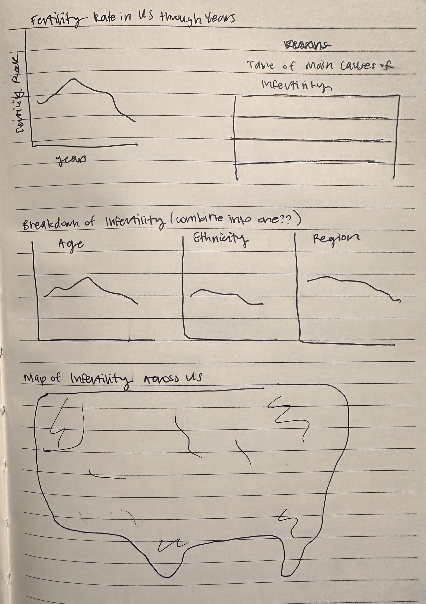
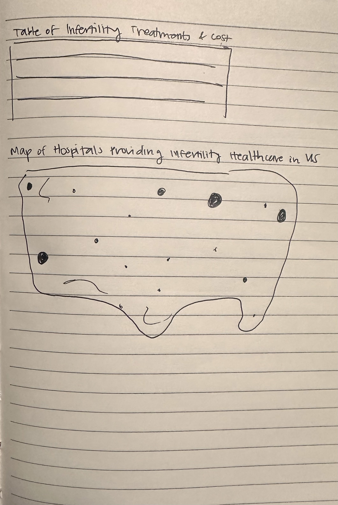

[home page](/README.md) || [visualizing government debt](/visualizing-government-debt.md) || [critique by design](/critique-by-design.md)

# Outline
For my final project, I decided to explore infertility in the US. Infertility affects millions of individuals and couples across the United States, and is a significant yet often overlooked aspect of reproductive health. There is a large stigma around infertility, and it tends to be a topic that is not openly discussed in society since many couples, especially women, feel ashamed and insecure about the struggles they face. 

Various treatment methods exist for infertility, ranging from medications to surgical interventions and advanced reproductive technologies like in vitro fertilization (IVF) and intrauterine insemination (IUI). However, these treatments often come with significant financial burdens, posing barriers to access for many individuals and families. The lack of comprehensive insurance coverage adds to the issue, which tends to leave a large portion of the population unable to afford these services. As a result, a considerable number of individuals in the country lack access to facilities offering infertility treatments, emphasizing the pressing need for more equitable and affordable healthcare solutions in this realm. Shedding light on infertility and its societal implications is important in the process of creating a more compassionate and understanding society where everyone feels validated and supported in their reproductive health experiences.
 
I plan to start by showing the rate of infertility in the US and how it has changed through the years and how it has increased. I want to also show data here describing the impact of infertility on individuals and how it can affect their health. I then hope to show a table of the main causes of infertility, as well the the percentage of individuals it affects in the US. Following this, I plan to make a breakdown of infertility rates by focusing in on the effevt of age, ethnicity, race, and US region impact these rates. After this I plan to display another table breaking down the various infertility treatments available and their costs, and then display the hostpitals around the country that provide infertility healthcare in the US.

## Initial sketches
Here are some sketches of how I plan to display the information described above.

# The data
> A couple of paragraphs that document your data source(s), and an explanation of how you plan on using your data. 

Text here...

| Name | URL | Description |
|------|-----|-------------|
|      |  https://www.cdc.gov/nchs/nsfg/key_statistics/i-keystat.htm   |             |
|   Number of infertile women by state    |  https://resolve.org/learn/financial-resources-for-family-building/insurance-coverage/getting-insurance-coverage-at-work/number-of-infertile-by-state/   |    Uses data from 2010 U.S. Census and the National Survey of Family Growth from 2015-2017 to determine number of infertile women by state     |
|  National Library of Medicine Fertility care study | https://www.ncbi.nlm.nih.gov/pmc/articles/PMC2860047/table/T1/?report=objectonly  | Breakdown of 428 women seeking fertility care by demographic, socioeconomic, treatment, and outcome  |
|     |  https://data.worldbank.org/indicator/SP.DYN.TFRT.IN?end=2021&start=1960&view=chart   |     |
|   | https://data.oecd.org/pop/fertility-rates.htm   |    |
| | https://data.cms.gov/provider-data/dataset/nrdb-3fcy | |
| | https://www.ncbi.nlm.nih.gov/pmc/articles/PMC3043157/ | |
| | https://data.cdc.gov/Assisted-Reproductive-Technology-ART-/2021-Final-Assisted-Reproductive-Technology-ART-Se/ix4g-rt8v/about_data | |

# Method and medium
I plan to use Shorthand for the final project, and am thinking of using both Tableau and Flourish to create my visualizations. I also plan to use Canva to create a moodboard as well as a design guideline template.
